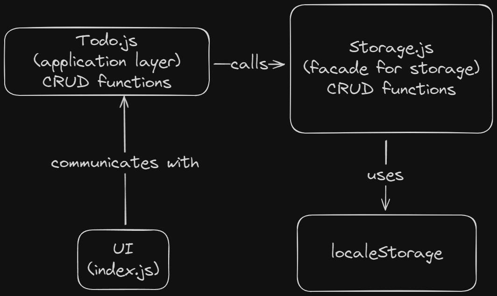

# Todo List - The Odin Project

[Project Link](https://www.theodinproject.com/lessons/node-path-javascript-todo-list)

## Planning

### Features

- Todo Item:
  - Title
  - Description
  - Due Date
  - Priority
  - Notes
  - Checklist
- Projects:
  - are separte lists of Todos
  - there should be a default project all unspecified todos are put in
  - users should be able to create projects and add todos to them

### Constraints

- Separate UI and Application Logic
  - Separate modules
- UI should have:
  - All projects view
  - All todos in one projects view (title and due date, color for priorities)
  - Expand single todo to see all details
  - Delete todo
- Use webpack and the date-fns library to easily format dates
- Use local storage for persistant user storage
  - Make it fault tolerant so app doesn't crash if the local storage data doesn't exist

### Diagram:



### Other Planning:

- Every todo/project will have a unique id
- Data structure:
```ts
let Priority  = Object.freeze({
  low: 0,
  medium: 1,
  high: 2
})

interface checklistItem {
  done: boolean,
  description: string,
}

interface todo {
  id: number,
  description: string,
  dueDate: Date,
  priority: Priority,
  notes: string,
  checklist: Array<checklistItem>
}

interface project {
  id: number,
  todos: Array<todo>
}
```
